<link href="_style.css" rel="stylesheet" type="text/css">

<a name="top"></a>
# AlphaLib for Unity

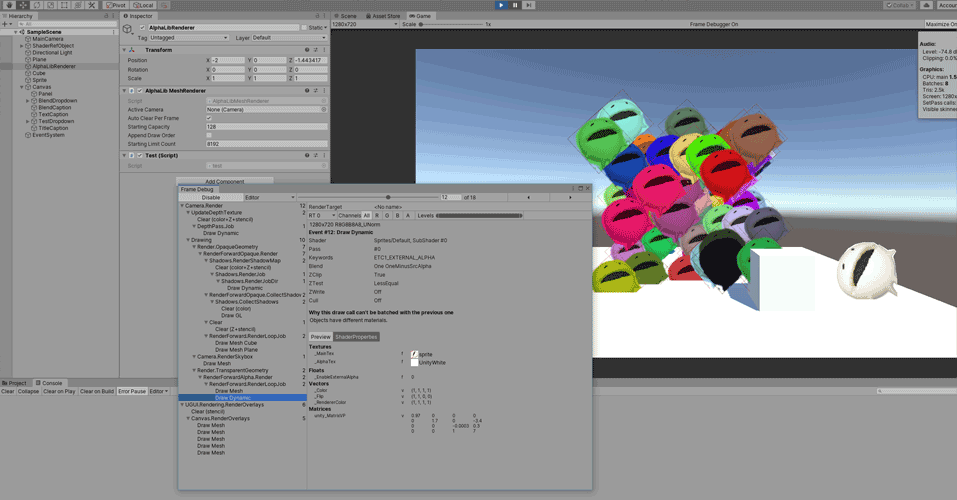

その昔、シューティングゲーム用にとあるソフトウェアグラフィックライブラリがDelphiでありました。
時代は変わり、Unityで作ってみたものです（５年ほど前に）。

今の言葉で言えば、**スプライト表示アセット**とでも言うのでしょうか。

テクスチャの一部を任意の場所に（そこそこ）大量に表示するためのアセットです。１フレーム単位で表示内容がコロコロ変わるケースにおいて効果を発揮します。具体的には、ダメージ表示であったり、STGの弾幕だったり。ゲーム制作においては必要不可欠な要素です。

<a name="feature"></a>
# Feature

このライブラリは、残念ながらPCやPS4/5の最先端技術を追うものではありません。低性能、低機能、古いAndroid端末でも動くように設計されています。

* **モバイルフレンドリー**。おおよそDirectX9、PixelShader2.0、GLES2.0ぐらいの要求です。
* 半透明に特化しています。（不透明ならもっと他に高速なライブラリがあるでしょう）
* やっぱりTextureの座標指定はピクセルで、左上が0,0で使いたい。
* 描画をまとめるバッチング機能あります。
* 固定Shader時代の大まかなブレンディングに対応。
* 乗算色、スクリーン色(tintcolor)の2色混合ブレンディングをサポート。
* 制限はありますが、3DのMeshも使用可能。
* マルチテクスチャブレンド（ブレンド、フェード、マスクなど）もあるよ。

半透明平面スプライトをいっぱい表示する事を目的としていますが、それほど速い訳ではありません。
速度よりも互換性や利便性を優先しています。
Spriteに3DMeshも混ぜて扱えるように、ハイブリッドな作りになっています。

もし数万個のパーティクルを（順序を考慮せず）表示したいのであれば、これではなくUnityのInstanced機能を使うべきです。

## Lost feature

なお、前身のAlphaLibから失った大きな物が有ります。**描画順(dwor order)** です。

Unityにおいて、これを回避する手段は、レンダリングパイプラインを改造するという手段しかなく、互換性に難があります。DrawMeshNowという抜け道は有るものの『このモードでは根幹部分で必要となるMaterialPropertyBlockが使えない』ということで、手詰まりです。

一応、**バッチング**ではサポートはしています。

つらい。

<a name="license"></a>
# License

MITライセンスです。お好きなように。

```
Under the MIT License. 

This AlphaLib-Library(srccode & shader) is licensed under the Expat License, sometimes known as the MIT License:
Copyright Ko-Ta Takeuchi.

Permission is hereby granted, free of charge, to any person obtaining a copy of this software and associated documentation files (the "Software"), to deal in the Software without restriction, including without limitation the rights to use, copy, modify, merge, publish, distribute, sublicense, and/or sell copies of the Software, and to permit persons to whom the Software is furnished to do so, subject to the following conditions:

The above copyright notice and this permission notice shall be included in all copies or substantial portions of the Software.

The Software is provided "as is", without warranty of any kind, express or implied, including but not limited to the warranties of merchantability, fitness for a particular purpose and noninfringement. In no event shall the authors or copyright holders be liable for any claim, damages or other liability, whether in an action of contract, tort or otherwise, arising from, out of or in connection with the Software or the use or other dealings in the Software.
``````

<a name="setup"></a>
# How to setup

## Renderer

サンプルのAssetの中に**AlphaLib**フォルダがあるので、フォルダごと使いたいプロジェクトのAssetフォルダにコピペしましょう。

unityエディタ上にD&Dでも良いですし、OS上でコピー＆ペーストしても構いません。

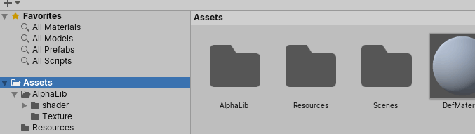

次に適当なGameObjectに**AlphaLibRenderer**スクリプトをくっつけます。

AddComponentボタン、またはComponentメニューから `AlphaLib/AlphaLib MeshRenderer` を選択してください。

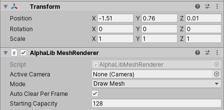

これで完了です。
1シーン内に複数追加して構いません。

## Texture

次に表示したい画像をUnityにぶち込みます。

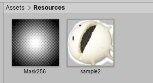

unityでは個々の画像に対してテクスチャ設定を行う必要があります。

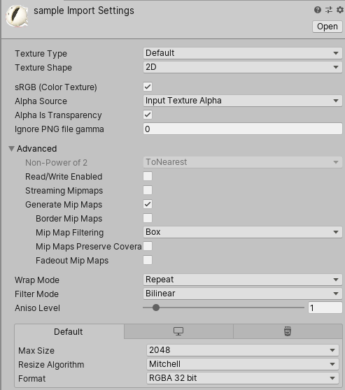

いきなりハードルが高いですが、この画像の設定を参考にしてください。

### PMA(Pre multiplied alpha)

PMA、アルファ計算済テクスチャですが、`BlendMode.PMA` で対応しています。ですが、このライブラリで使用する場合は恩恵はほぼありません。基本は乗算焼き付けを行わない `bleed` 形式の使用を強く勧めます。

## Setup code

上記で描画に必要なリソースの準備は整ったので、プログラムに移ります。

``` csharp
    private AlphaLib.Renderer AL;
    private AlphaLib.ALMaterial ALMat;
    private Texture2D MainTex, SubTex;

    void Start()
    {
        // get AlphaLib
        var c = gameObject.GetComponent<AlphaLib.AlphaLibMeshRenderer>();
        AL = c.ALRenderer;

        // texture loading from resource/
        MainTex = Resources.Load<Texture2D>("sample");
        SubTex = Resources.Load<Texture2D>("mask");

        // material
        ALMat = AlphaLib.Misc.CreateMaterial(
            AlphaLib.Normal,            // blend mode
            AlphaLib.ShaderMode.Single, // shader mode
            MainTex, null               // texture
        );
        // virtual size
        SrcMaterial.SetVirtualSize(256, 256);
    }
```

AlphaLibRendererコンポーネント、テクスチャを取得し、AlphaLib専用のマテリアルを生成します。

`CreateMaterial`でブレンドモード、描画の種類（シェーダー）、使用するテクスチャごとにマテリアル生成することになります。このあたりの取り回しはUnityのシステムによるところです。

見慣れない`VirtualSize`は、そのテクスチャの座標を指定する際の仮想サイズを指定することが出来ます。指定しておくと、テクスチャサイズが変わってもコードを変更する必要がなくなる便利な機能です。

## Draw code

では実際に描画してみましょう。
**void Update()**に書いていきます。

```csharp
void Update()
{
    var rnd = new System.Random();
    var m = Matrix4x4.identity;

    for (var i = 0; i < 100; i++)
    {
        var color = new Color(1, 1, 1, 1);
        var tintcolor = new Color(0, 0, 0, 0);

        // plane setting
        var ps = new AlphaLib.PlaneSetting();
        ps.Clear();
        // dest
        ps.DestMode = AlphaLib.PlaneSettingMode.Size;
        ps.alignx = 0.5f;
        ps.aligny = 0.5f;
        ps.drz = Time.time / 2 * 360;
        ps.dx1 = (float)rnd.NextDouble() * 2.0f - 1.0f;
        ps.dy1 = 0.0f;
        ps.dx2 = 1.0f;
        ps.dy2 = 1.0f;
        ps.dz1 = 0 + i * 0.02f;
        // src
        ps.SrcMode = AlphaLib.PlaneSettingMode.Area;
        ps.sx1 = 0;
        ps.sy1 = 0;
        ps.sx2 = 256;
        ps.sy2 = 256;

        AL.DrawPlane(ALMat, ref ps, color, tintcolor);
    }
}
```
100回ループしてdrawするだけの内容です。

### color

乗算色(diffuse color)とスクリーン色(tint color)が指定できます。
今回は、tintcolorのalphaは使用しません。（マルチテクスチャブレンドの場合に使用されます）

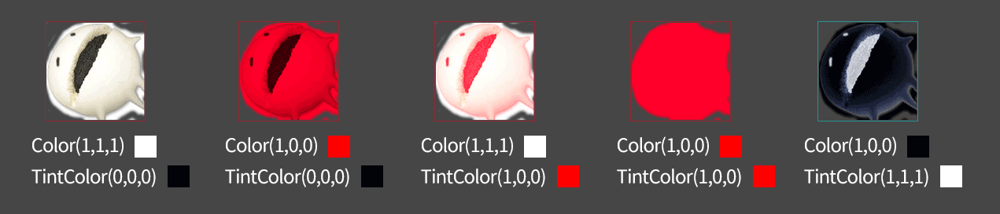

デフォルト（透過色）は、乗算色が白(1,1,1)、スクリーン色が黒(0,0,0)です。
乗算色で暗く、スクリーン色で明るくします。それぞれに同色を設定すると塗りつぶし効果になります。２色同時に扱うのは難しいですが、上記のパターンだけ覚えておけばいいと思います。

### PlaneSetting

2D画像を配置する際、範囲を制御するか、中心点で制御するか、2ケースがあります。どちらも一長一短で、箇所により使い分けることになるかと思います。このクラスは、その両方をサポートするものです。

この例では、最も使用されることが多い、転送先は中心点、転送元は範囲で指定しています。

### Rendering

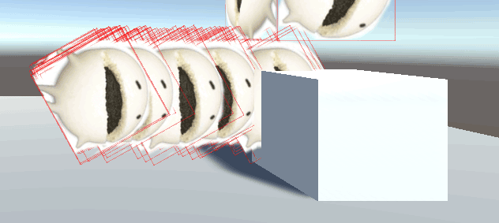
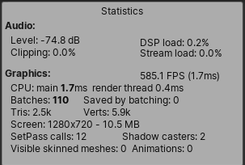

100枚表示しました。

レンダリングステータスを表示させると。
batchesが110、SetPassは110ではなく12となっています。同じMaterialなのでちゃんと最適化されたことを意味しています。

<a name="publish"></a>
# Build and run , publish

では実際のアプリに出力してみましょう。WindowsなりMacなりLinuxなり、webGLでも動きます。

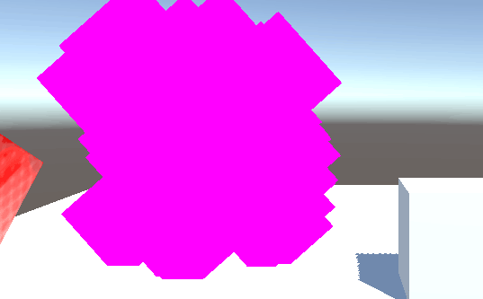

Unityおなじみエラーの紫。残念でした。

Unityには、パブリッシュの際に使わないシェーダーファイルを除外する機能が備わっています。そのため、プログラムから動的に読み込むものは候補から漏れて、除外されてしまいます。

### Shader reference GameObject

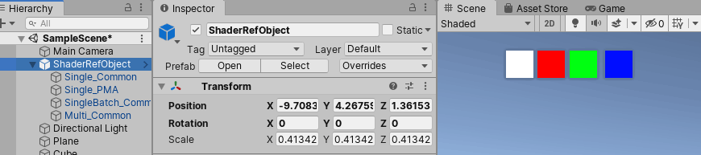

まずは **おすすめの方法** から。

「除外されるなら、シーンに参照するオブジェクト入れておけば良いじゃん」というシンプルな方法です。これが最も楽ちんです。

`AlphaLib/ShaderRefObject.prefub`というプレファブファイルを用意しているので、これをシーンに配置してください。サンプルでもこの手法を使っています。

### Always Included Shaders

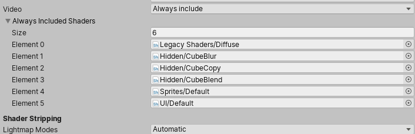

プロジェクト設定の`Graphics`でShaderのホワイトリストを指定できます。
が、いささか面倒です。

### Resource folder

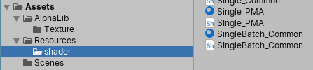

実はUnityの癖で、`Resource`フォルダなら選別されません。

「あの、Assetsから移動させたらパス変わるんじゃないですか？」という心配がアリマスが、Shaderはファイルパスでは無く記述されている識別名で管理されています。
```
Shader "AlphaLib/Multi_Common"
{
    Properties
    {
```
なので、ファイルはどこに移動させてもリンクが切れたりしないんです。わからん。

# Batching


描画をまとめることをバッチングと言い、SetPass（Materialの変更）を極力抑えることを目的とします。

先に結論を言っておきますが、実際それほど速くなりません。それはSetPassにも『重いもの』と『軽いもの』があり、色やテクスチャを変えたぐらいでは重くならないと言うことです。

なので、SetPass問題はそんなに神経質になる必要はありません。

## SetPass

まずは、Unityではよく議題に上がるSetPassについて言及しておきます。
これは、大雑把に言うと、1フレームで行われるMaterialの変更回数です。この値は少ないほど有利とされています。

ではちょっと色をランダム表示するようにしてみます。

```csharp
    var color = new Color(
        (float)rnd.NextDouble(), 
        (float)rnd.NextDouble(), 
        (float)rnd.NextDouble(), 
        1
    );
    var tinitcolor = new Color(0, 0, 0, 0);
```
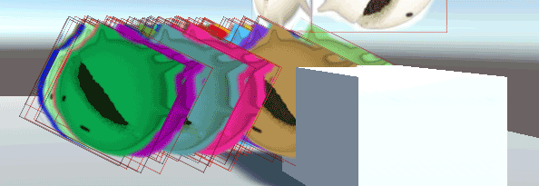
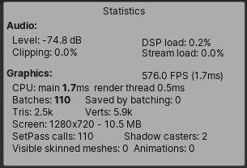

SetPassが110に増えました。

unityではSetPassは簡単に増えちゃうんです。そこで活躍するのが**バッチング**です。

## MeshBatcher , MeshBatcherSortable

バッチングを行うbatcherには２つあります。書き込むだけのシンプルな **MeshBatcher** と、一度蓄えてソーティングが行える **MeshBatcherSortable** です。

バッチングには厳しい制限があります。使えるのは１マテリアルのみです。なので、使える場面は限られています。STGなら弾幕、RPGならマップチップぐらいでしょうか。

```csharp
    protected AlphaLib.MeshBatcherSortable Batcher = new AlphaLib.MeshBatcherSortable();
    ...
        void Start()
        {
            ...
            BatchMat = AlphaLib.Misc.CreateMaterial(
                AlphaLib.Normal,
                AlphaLib.ShaderMode.SingleBatch,  // batch shader
                MainTex, null
            );
            BatchMat.SetVirtualSize(256,256);
        }
```
特別な下準備は不要ですが、バッチ専用のMaterialが必要になるので、新たに作っておきましょう。
```csharp
    void Update()
    {
        var rnd = new System.Random();
        var m = Matrix4x4.identity;

        for (var i = 0; i < 100; i++)
        {
            var color = new Color(
                (float)rnd.NextDouble(),
                (float)rnd.NextDouble(),
                (float)rnd.NextDouble(),
                1
            );
            var tintcolor = new Color(0, 0, 0, 0);

            // plane setting
            var ps = new AlphaLib.PlaneSetting();
            ps.Clear();
            // dest
            ps.DestMode = AlphaLib.PlaneSettingMode.Size;
            ps.alignx = 0.5f;
            ps.aligny = 0.5f;
            ps.drz = Time.time / 2 * 360;
            ps.dx1 = (float)rnd.NextDouble() * 2.0f - 1.0f;
            ps.dy1 = 0.0f;// (float)rnd.NextDouble() * 2.0f - 1.0f;
            ps.dx2 = 1.0f;
            ps.dy2 = 1.0f;
            ps.dz1 = 0 + i * 0.02f;
            // src
            ps.SrcMode = AlphaLib.PlaneSettingMode.Area;
            ps.sx1 = 0;
            ps.sy1 = 0;
            ps.sx2 = 256;
            ps.sy2 = 256;

            Batcher.DrawPlane(ref ps, BatchMat, color, tintcolor, 0.0f);
        }

        Batcher.Build();

        AL.DrawMesh(
            ref m, Batcher.Mesh, BatchMat, 
            new Color(1,1,1,1), new Color(0,0,0,0)
        );
    }
```
Batcherに描画情報を渡してメッシュを構成、それをAlphaLibRendererで描画するという流れになります。


SetPassが110みぎから11と減少しました。

最初にも述べましたが、そんなに速くなったりはしません。

<a name="DrawMesh"></a>
# Draw 3DMesh

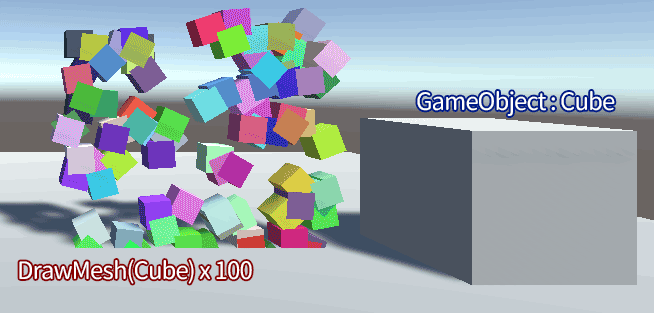

簡単な3Dメッシュも扱えます。
基本的にボーンなどが無いシンプルなものに限定されますが、ミサイルいっぱい出したいなぁ！なんて言う場合は便利です。

```csharp
        {
            var rnd = new System.Random();

            // get mesh & material from "cube" GameObject.
            var g = GameObject.Find("Cube");
            var mesh = g.GetComponent<MeshFilter>().sharedMesh;
            var mats = g.GetComponent<MeshRenderer>().sharedMaterials;

            for (var i = 0; i < 100; i++)
            {
                // Matrix4x4.TRS()
                var m = Matrix4x4.identity;
                // size
                AlphaLib.Misc.m4PushScale(ref m, 0.2f, 0.2f, 0.2f);
                // rotate
                AlphaLib.Misc.m4PushRotateZ(ref m, (float)rnd.NextDouble() * 360);
                // move
                AlphaLib.Misc.m4PushMove(
                    ref m, 
                    (float)rnd.NextDouble() * 2.0f - 1.0f, 
                    (float)rnd.NextDouble() * 2.0f - 1.0f,
                    0
                );

                var color = new Color(
                    (float)rnd.NextDouble(),
                    (float)rnd.NextDouble(),
                    (float)rnd.NextDouble(),
                    1
                );
                var tintcolor = new Color(0, 0, 0, 0);

                // draw mesh
                var log = AL.DrawMesh(ref m, mesh, mats);
                // set MaterialPropertyBlock
                log.block.SetColor("_Color", color);
            }
        }
```
ランダムに色を変えていますが、これは使用されるMaterialに依存します。今回はUnityのStandertShaderなので、`_Color`を書き換えれば色が変わるという前提があります。

<a name="DrawSprite"></a>
# Draw sprite

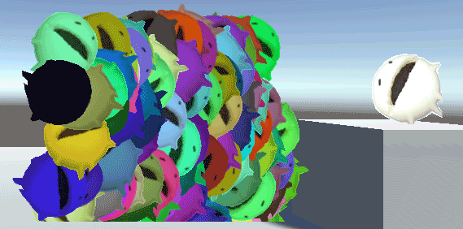

今までテクスチャから描画していましたが、Unityが提供するSpriteにも対応しています。
が、ポリゴン数が多くなりがちで、良いスコアはあまり出ません。

使用方法はサンプルを参照ください。

<a name="MeshBatch"></a>
# Mesh batching

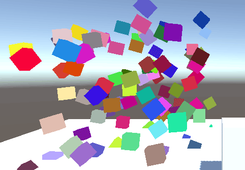

Meshのバッチング機能も持っています。
が、これもSpriteと同様で、頂点数が多くなるため重くなりがちです。またマテリアルや光源などの問題もあってなかなかに使いにくいです。

使用方法はサンプルを参照ください。


